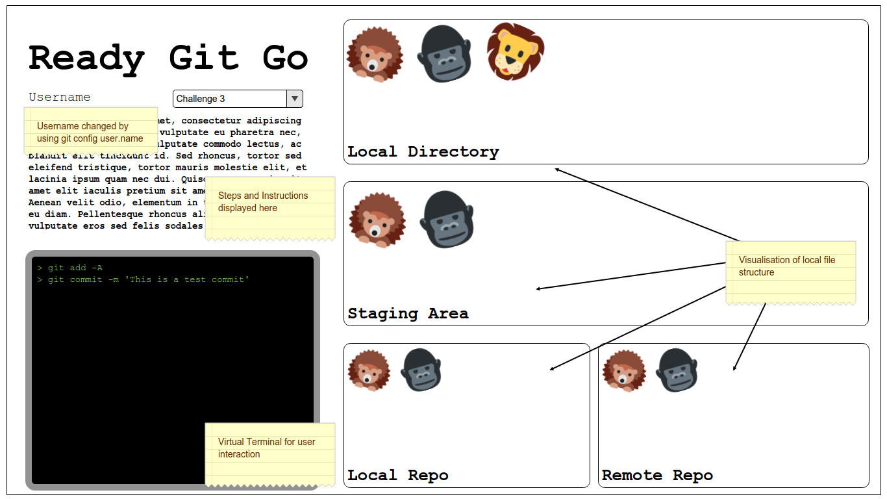

# Ready Git Go - Learn Git Quick

## Background and Overview

Ready Git Go is a game about git. The game is meant to teach users the basic concepts and terminal commands to get started with git, inspired by similar games like [Flexbox Froggies](http://flexboxfroggy.com/) and [Grid Garden](http://cssgridgarden.com/).

Users will go through the entire process of initializing a repository, learning about staging, checking the differences in different commits, adding a remote repository, etc. All these changes will be reflected on the webpage itself

Users will interact with a virtual terminal using the same commands as they would in an actual development environment. To simplify the experience, users will refer to various animals rather than long filenames.

## Functionality & MVP

- [ ] Working terminal that can understand and accept basic terminal commands
- [ ] Multiple levels taking the user through the setup of a git repository
- [ ] Display of each "stage" of the git environment:
  * Local directory
  * Stagin Area
  * Local repository
  * Remote repository
- [ ] Terminal commands can manipulate the "file structure"

### Bonus
- [ ] A "free-roam" mode where the user can practice what they've learnt by going through the entire setup again without any instructions

## Wireframe

## Technologies

This project will be implemented using:
* A mix of Vanilla JS and `jQuery`.
* `HTML5 Canvas` for manipulating the various images of each stage in git.
* Webpack to bundle the various scripts that will be used.

### Planned Scripts:
* `level-*.js` - One file for each level that will include information such as the current "file directory", references to the various animals to be displayed, the differences in each stage of the git, etc
* `terminal.js` - Controls the terminal that is displayed on the webpage
* `files.js` - Controls the virtual file structure depending on the information given by each level

## Implementation Timeline
### Weekend
- [x] Setup basic terminal view that accepts basic commands
- [x] Setup the webpack environment

### Day 1:
- [ ] Complete terminal that accepts commands and returns proper results
- [ ] Set up git stage views that are manipulated by the terminal
- [ ] Begin creating the "file directory" with the various animals
- [ ] Initial styling

### Day 2:
- [ ] Draft levels and file structure for each level
- [ ] Setup the file directory to be manipulated by the terminal commands
- [ ] Begin coding first few levels

### Day 3:
- [ ] Complete all levels
- [ ] Setup up virtual terminal to control the git views using various git commands

### Day 4:
- [ ] Final debugging
- [ ] Test all levels
- [ ] Final styling

## Notes
Animal Icons designed by [Twitter](https://twitter.com/) from [Flaticon](https://www.flaticon.com/packs/animal-and-nature)
