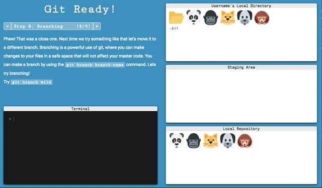

# Git Ready! - Learn Git Quick

## [Play Git Ready!](https://hkumar1993.github.io/Git-Ready/)

## Background and Overview

Git Ready! is a game designed to teach users the basics of git. The game includes a virtual terminal and a virtual git environment which is controlled by the terminal. The game is made as a pure frontend app using jQuery.

### Terminal


The terminal is made entirely in HTML and CSS. Commands in the terminal pass through multitudes of if-else and switch statements to determine what each command does and what changes do they execute on the virutal environment.

### Virtual Environment

The virtual environment displays multiple windows for each stage of the git environment, including a local directory, staging area, and local repository.


When branching, the environment also displays the branched files and branched repository.



### Flux-style Architecture

The entire app is created on a flux-based principle.
* A global state that holds all data that is to be displayed
* Various functions cause changes in the state
* Changes to the state force re-renders of the page

#### Global State:
```javascript
let gitState = {
  initialized: false,
  remote: false,
  branch: {
    checkout: false,
    name: '',
    fileStructure: {

    },
    commitHistory: [],
    status: false
  },
  currentCommand: '',
  previousCommands: [],
  fileStructure: {
  },
  terminalCount: 0,
  level: 1,
  previousLevel: 1,
  render,
  commitHistory: [],
  commit: '',
  step: '',
  instructions: '',
  username: ''
}
```

#### React style components

This project replicates the integration of jsx components in React. The global state holds a string which is actually HTML code, and on re-render changes the DOM in order to display that "component". All 9 levels and the multitude of sub-levels are displayed as such.

```javascript
case 1:
  gitState.initialized = false
  gitState.remote = false
  gitState.step = "<span>Step 1: Initialize</span><span>(1/9)</span>"
  gitState.instructions =
  "<p>Welcome to <span class='bg'>Git Ready!</span> ...  </p>"
  gitState.fileStructure = firstAnimals
```

### Credits
Animal Icons designed by [Twitter](https://twitter.com/) from [Flaticon](https://www.flaticon.com/packs/animal-and-nature)
